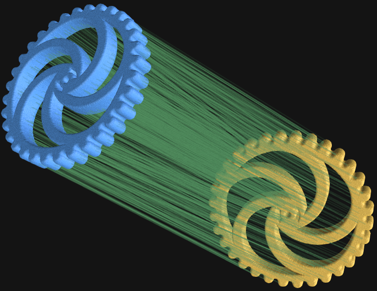

# Fast, Memory-Efficient Approximate Wasserstein Distances
This repository contains PyTorch code to compute fast p-Wasserstein distances between d-dimensional point clouds using the [Sinkhorn Algorithm](https://arxiv.org/abs/1306.0895).

This implementation uses **linear memory overhead** and is **stable in float32, runs on the GPU, and fully differentiable**.

This shows an example of the correspondences between two shapes found by computing the Sinkhorn distance on 200k input points:
<p align="center">
  
</p>

## How to use:
1. Copy the `sinkhorn.py` file in this repository to your PyTorch codebase.
2. `pip install pykeops tqdm`
3. Import `from sinkhorn import sinkhorn` and use the `sinkhorn` function!

### Running the example code
Look at [example_basic.py](example_basic.py) for a basic example and [example_optimize.py](example_optimize.py) for an example of how to use Sinkhorn in your optimization

**NOTE:** To run the examples, you need to first run
```
pip install pykeops tqdm numpy scipy polyscope point-cloud-utils
```

## `sinkhorn` function documentation
```
sinkhorn(x: torch.Tensor, y: torch.Tensor, p: float = 2,
             w_x: Union[torch.Tensor, None] = None,
             w_y: Union[torch.Tensor, None] = None,
             eps: float = 1e-3,
             max_iters: int = 100, stop_thresh: float = 1e-5,
             verbose=False)
```
Computes the Entropy-Regularized p-Wasserstein Distance between two d-dimensional point clouds
using the Sinkhorn scaling algorithm. This code will use the GPU if you pass in GPU tensors.
Note that this algorithm can be backpropped through
(though this may be slow if using many iterations).

**Arguments:**

* `x`: A `[n, d]` shaped tensor representing a d-dimensional point cloud with `n` points (one per row)
* `y`: A `[m, d]` shaped tensor representing a d-dimensional point cloud with `m` points (one per row)
* `p`: Which norm to use. Must be an integer greater than 0.
* `w_x`: A `[n,]` shaped tensor of optional weights for the points `x` (`None` for uniform weights). Note that these must sum to the same value as w_y. Default is `None`.
*  `w_y`: A `[m,]` shaped tensor of optional weights for the points `y` (`None` for uniform weights). Note that these must sum to the same value as w_y. Default is `None`.
*  `eps`: The reciprocal of the Sinkhorn entropy regularization parameter.
*  `max_iters`: The maximum number of Sinkhorn iterations to perform.
*  `stop_thresh`: Stop if the maximum change in the parameters is below this amount
*  `verbose`: If set, print a progress bar

**Returns:**

A triple `(d, corrs_x_to_y, corr_y_to_x)` where:
* `d` is the approximate p-wasserstein distance between point clouds `x` and `y`
* `corrs_x_to_y` is a `[n,]`-shaped tensor where `corrs_x_to_y[i]` is the index of the approximate correspondence in point cloud `y` of point `x[i]` (i.e. `x[i]` and `y[corrs_x_to_y[i]]` are a corresponding pair)
* `corrs_y_to_x` is a `[m,]`-shaped tensor where `corrs_y_to_x[i]` is the index of the approximate correspondence in point cloud `x` of `point y[j]` (i.e. `y[j]` and `x[corrs_y_to_x[j]]` are a corresponding pair)

